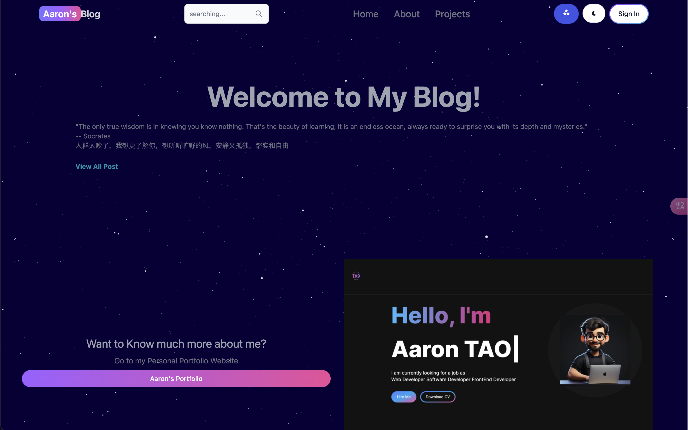

# Resonsive MERN Blog

Resonsive MERN Blog is a responsive blogging platform built on the MERN technology stack. By combining MongoDB, Express.js, React and Node.js, it provides a simple yet powerful platform for creating, editing and sharing blog posts. The project has an adaptive design that provides a consistent user experience across a wide range of devices.

Link:https://www.aaronblog.top/

<p align="center">
  <a href="https://github.com/shaojintian/Best_README_template/">
    
  </a>


</p>


### **User Features:**

1. ***\*Authentication\****:

2. - Signup: Register an account to access the platform.
   - Signin: Log in with your credentials securely.
   - Signout: Log out of your account to ensure privacy.

3. ***\*Authentication Methods\****:

4. - Google Auth: Seamlessly log in using your Google account for added convenience and security.

5. ***\*Content Management\****:

6. - Post Management:

   - - Upload: Share your thoughts by creating and publishing posts.
     - Update: Modify existing posts to keep your content fresh and relevant.
     - Delete: Remove posts as needed to maintain your content strategy.

   - Search:

   - - Filter: Easily search through posts using various filters such as category, keyword, and time period.

7. ***\*User Interaction\****:

8. - Home & Project Pages:

   - - Explore engaging content and animations on the home and project pages.
     - Access Posts: Browse through posts to discover valuable insights and information.

   - Engagement:

   - - Comment: Interact with other users by leaving comments on posts.
     - Like: Show appreciation for posts by liking them.
     - Delete: Manage your comments by deleting them if necessary.

### **Administrator Features:**

1. ***\*Content Management\****:

2. - Post Management:

   - - Create: Publish new posts to enrich the platform's content.
     - Edit: Make necessary modifications to existing posts for accuracy and relevance.
     - Delete: Remove posts that no longer align with the platform's objectives.

   - Comment Management:

   - - Edit: Modify comments to ensure compliance with community guidelines.
     - Delete: Remove inappropriate or irrelevant comments to maintain a positive user experience.

3. ***\*Analytics\****:

4. - Dashboard:

   - - Track Metrics: Monitor the total number of users, posts, and comments to gauge platform engagement and growth.

### **Get Started:**

1. ***\*User Registration\****:

2. - Sign up for an account to unlock access to all features.
   - Alternatively, use Google Auth for a streamlined authentication process.

3. ***\*Exploration\****:

4. - Dive into the platform's content by browsing through posts and exploring the home and project pages.

5. ***\*Engagement\****:

6. - Interact with posts by leaving comments, liking content, and contributing to the community discussions.

7. ***\*Content Management (Admin)\****:

8. - If you're an administrator, manage posts and comments efficiently to maintain a high-quality platform experience

1. 

- 

<br />


## Content

- [Basic Develop environment](#Basic Develop environment)
  - [Set Up](#Set Up)
- [Files Catalog Contents](#Files Catalog Contents)
- [How to Use](#How to Use)
- [Deployment](#Deployment)
- [Skills](#Skills)
- [Contributor](#Contributor)
  - [Open Source](#Open Source)
- [Version Control](#Version Control)
- [Author](#Author)
- [External Links](#External Links)

### Basic Develop environment


###### **Set Up Steps**

Clone the repo

```sh
https://github.com/HAONANTAO/BlogWeb.git
```


### Files Catalog ContentsFiles Catalog Contents


```
BLOGWEB
├── README.md
├── .env
├── LICENSE
├── .gitignore
├── package.json
├── yarn.lock
├── node_modules

├── client
│  ├── .env
│  ├── .eslintrc.cjs
│  ├── .gitignore
│  ├── App.css
│  ├── index.html
│  ├── package.json
│  ├── postcss.config.js
│  ├── tailwind.config.js
│  ├── vite.config.js
│  ├── yarn.lock
│  ├── dist
│  ├── node_modules
│  ├── public
│  ├── ├── planet
│  ├── ├── ├── textures
│  ├── ├── ├── ├── Clouds_baseColor.png
│  ├── ├── ├── ├── Planet_baseColor.png

│  ├── ├── ├── license.txt
│  ├── ├── ├── scene.bin
│  ├── ├── ├── scene.gltf

│  ├── ├── favicon1.ico
│  ├── ├── Portfolio.png
│  ├── ├── wechat.jpg

│  ├── src
│  ├── ├── App.jsx
│  ├── ├── firebase.js
│  ├── ├── main.js
│  ├── ├── redux
│  ├── ├── ├── theme
│  ├── ├── ├── ├── themeSlice.js
│  ├── ├── ├── user
│  ├── ├── ├── ├── userSlice.js
│  ├── ├── ├── store.js

│  ├── ├── assets
│  ├── ├── components
│  ├── ├── ├── ├── CallToAction.jsx
│  ├── ├── ├── ├── OAuth.jsx
│  ├── ├── ├── ├── PostCard.jsx
│  ├── ├── ├── ├── Canvas
│  ├── ├── ├── ├── ├── Earth.jsx
│  ├── ├── ├── ├── ├── Loader.jsx
│  ├── ├── ├── ├── ├── Scene.jsx
│  ├── ├── ├── ├── ├── StarsCanvas.jsx

│  ├── ├── ├── ├── Comments
│  ├── ├── ├── ├── ├── Comment.jsx
│  ├── ├── ├── ├── ├── CommentSection.jsx

│  ├── ├── ├── ├── Dashboard
│  ├── ├── ├── ├── ├── DashboardComp.jsx
│  ├── ├── ├── ├── ├── DashComments.jsx
│  ├── ├── ├── ├── ├── DashPosts.jsx
│  ├── ├── ├── ├── ├── DashProfile.jsx
│  ├── ├── ├── ├── ├── DashSidebar.jsx
│  ├── ├── ├── ├── ├── DashUsers.jsx

│  ├── ├── ├── ├── FixedUI
│  ├── ├── ├── ├── ├── Footer.jsx
│  ├── ├── ├── ├── ├── Header.jsx

│  ├── ├── ├── ├── Loading
│  ├── ├── ├── ├── ├── Loading.css
│  ├── ├── ├── ├── ├── LoadingScreen.jsx

│  ├── ├── ├── ├── Providers
│  ├── ├── ├── ├── ├── StarsProvider.jsx
│  ├── ├── ├── ├── ├── ThemeProvider.jsx

│  ├── ├── ├── ├── Utils
│  ├── ├── ├── ├── ├── OnlyAdminPrivateRoute.jsx
│  ├── ├── ├── ├── ├── PrivateRoute.jsx
│  ├── ├── ├── ├── ├── ScrollToTop.jsx


│  ├── ├── pages
│  ├── ├── ├── ├── About.jsx
│  ├── ├── ├── ├── CreatePost.jsx
│  ├── ├── ├── ├── Dashboard.jsx
│  ├── ├── ├── ├── Home.jsx
│  ├── ├── ├── ├── PostPage.jsx
│  ├── ├── ├── ├── Projects.jsx
│  ├── ├── ├── ├── Search.jsx
│  ├── ├── ├── ├── SignIn.jsx
│  ├── ├── ├── ├── SignUp.jsx
│  ├── ├── ├── ├── UpdatePost.jsx

├── server
│  ├── controllers
│  ├── ├── auth.controller.js
│  ├── ├── comment.controller.js
│  ├── ├── post.controller.js
│  ├── ├── user.controller.js

│  ├── models
│  ├── ├── comment.model.js
│  ├── ├── post.model.js
│  ├── ├── user.model.js

│  ├── routes
│  ├── ├── auth.route.js
│  ├── ├── comment.route.js
│  ├── ├── post.route.js
│  ├── ├── user.route.js

│  ├── utils
│  ├── ├── errorHandler.js
│  ├── ├── verifyUser.js

│  ├── index.js


│  ├── ├── auth/[...nextauth
│  ├── ├── ├── route.tsx

```

How to Use

```
yarn %% yarn dev
```


### Deployment

Render && Mongodb && Firebase


## Technologies Used

(MERN)

- **Frontend**: React.js, React Router DOM, Tailwind CSS, Flowbite React UI Library, Redux, Three.js, React Circular Progressbar, ReactQuill, Firebase
- **Backend**: Node.js, Express.js, MongoDB, JWT, Firebase Authentication
- **Other Tools/Libraries**: Moment.js, Pinyin, Send (for CORS handling), Tailwind-scrollbar


### Frontend Dependencies:

- **React**: JavaScript library for building user interfaces.
- **React Router DOM**: Library for declarative routing in React applications.
- **Redux and React-Redux**: State management library for managing application state.
- **redux-persist**: Library for persisting Redux state in storage.
- **axios**: Promise-based HTTP client for making requests to the backend.
- **@tailwindcss/line-clamp**: Tailwind CSS plugin for truncating text with ellipsis.
- **moment**: Library for parsing, validating, manipulating, and formatting dates and times.
- **react-circular-progressbar**: Circular progress bar component for React applications.
- **react-quill**: Rich text editor component for React applications.
- **react-icons**: Library containing popular icon packs as React components.
- **tailwind-scrollbar**: Tailwind CSS plugin for styling scrollbars.

### Backend Dependencies:

- **Express.js**: Web application framework for Node.js.
- **MongoDB and Mongoose**: MongoDB driver and ORM for interacting with MongoDB database.
- **bcrypt**: Library for hashing passwords securely.
- **jsonwebtoken**: Library for generating and verifying JSON Web Tokens (JWT) for user authentication.
- **cors**: Middleware for enabling Cross-Origin Resource Sharing (CORS).
- **cookie-parser**: Middleware for parsing cookies attached to the client request.
- **dotenv**: Library for loading environment variables from a .env file.

### Additional Dependencies:

- **firebase**: Firebase SDK for integrating Firebase services such as authentication and storage.
- **flowbite**: UI library for building modern web applications.
- **three**: JavaScript 3D library for creating and displaying 3D graphics in a web browser.

### Key Points:

1. **React Router DOM**: Utilized for client-side routing to handle navigation within the application.
2. **Tailwind CSS Decorations**: Styling of UI components using Tailwind CSS with custom decorations.
3. **Theme Switching**: Ability to toggle between light and dark themes, with a custom starry sky theme option.
4. **MERN Stack**: MongoDB for the database, Express.js for the backend, React.js for the frontend, and Node.js for server-side logic.
5. **JWT Authentication with Redux**: User authentication using JSON Web Tokens (JWT) managed through Redux for global state management.
6. **Flowbite React UI Library**: UI components from the Flowbite React UI library, seamlessly integrated with Tailwind CSS.
7. **Backend with MongoDB**: MongoDB used for the backend with schemas/models defined using Mongoose.
8. **Separated MVC Structure**: Routes for routing, controllers for handling logic outside of routes.
9. **Redux for Global State Management**: Utilized Redux for managing global application state.
10. **Persistent Redux Information**: Persisted Redux state for retaining user preferences and session data.
11. **Google OAuth with Firebase**: Google account authentication implemented using Firebase authentication.
12. **Cross-Origin Requests Handling**: CORS handling with requests sent to the backend using Send to resolve cross-origin issues.
13. **React Circular Progressbar**: Circular progress bar component used for visual loading indication.
14. **ReactQuill Text Editor**: Implementation of the ReactQuill text editor with considerations for color scheme adjustments in different themes.
15. **Firebase Storage for Avatar Uploads**: Uploading of avatar images to Firebase storage for efficient storage and retrieval.
16. **Chinese Slug Handling with Pinyin**: Handling of Chinese title slugs with pinyin conversion.
17. **Time Handling with Moment.js**: Efficient time handling utilizing the Moment.js library.
18. **Comment Section Functionality**: Implementation of functional comment sections with parent-defined functions passed to child components.
19. **Startup Animation**: Added a 1-second startup animation for an engaging initial user experience.

### Contributor

HAONANTAO 

#### Open Source

Contributing makes the open-source community a great place to learn, inspire and create. Any contribution you make is **very much appreciated**!

1. Fork the Project
2. Create your Feature Branch (`git checkout -b feature/AmazingFeature`)
3. Commit your changes (`git commit -m 'Add some AmazingFeature'`)
4. Push to the Branch (`git push origin feature/AmazingFeature`)
5. Open a Pull Request


### Version Control

Using Git as the version control and rollback if any issue


### Author

HAONANTAO


### External Links


- video[](#https://www.youtube.com/watch?v=Kkht2mwSL_I)

- github sourcecode[](#https://github.com/sahandghavidel/mern-blog)

  
### Using Docker to run the App
open the Docker Desktop
Run 

docker-compose up --build


<!-- links -->

